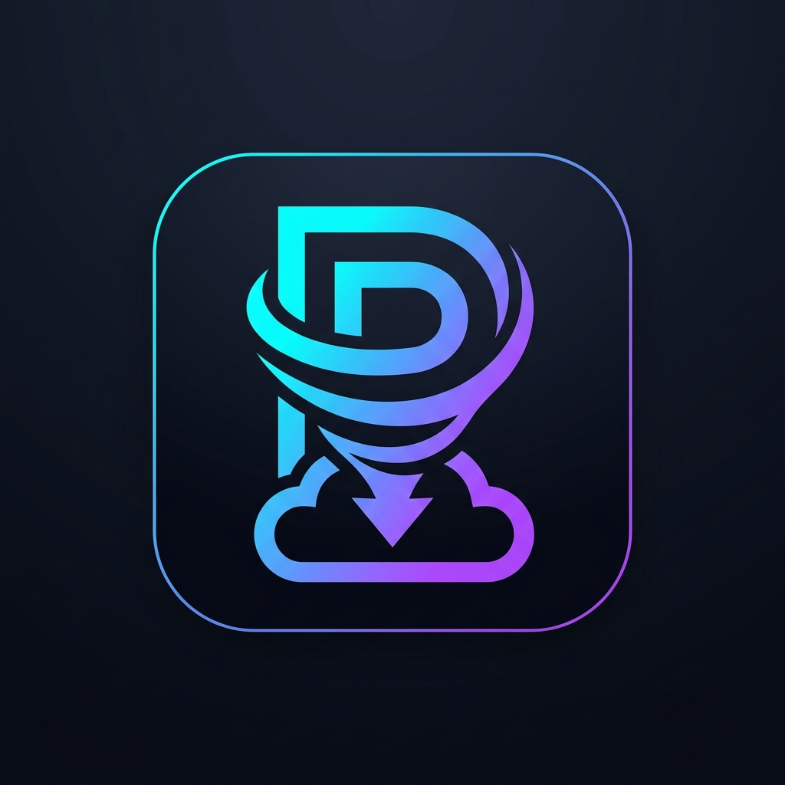

# PikLeech (多账号聚合网盘与离线下载系统)

<p align="center">
  
</p>

<p align="center">
  <b>高性能、低内存、多用户隔离的 PikPak 多账号聚合离线下载与虚拟云盘系统</b>
</p>

<p align="center">
  <a href="https://github.com/akasls/PikLeech/actions"></a>
  <a href="https://github.com/akasls/PikLeech"></a>
  <a href="https://react.dev"></a>
  <a href="https://github.com/akasls/PikLeech/pkgs/container/pikleech"></a>
  <a href="LICENSE"></a>
</p>

---

## 🌟 核心特性

- **统一虚拟文件系统**：跨账号聚合全部文件列表，彻底消除账号割裂；基于 `account_id + file_id` 规避冲突，支持毫秒级全文检索、按文件名/大小/时间排序及网格封面视图。
- **智能离线调度与配额轮询**：
  - **优先级 + 轮询 (Priority + Round Robin)** 调度算法。
  - **额度耗尽自动转移**：捕获 `daily task limit reached` / 配额超限后，自动毫秒级故障转移至下一个可用账号继续执行。
  - **精细错误分流**：严格区分额度不足、Token 失效、代理故障、429 频控与网络抖动，网络抖动采用指数退避重试，保障账号高可用。
- **存储自动均衡与过期清理**：
  - 动态容量评估：根据待离线资源大小与各账号剩余可用空间，智能分发至空间充足的账号，防止单账号爆满。
  - 过期自动清理：支持定时自动清理 X 天前的历史离线文件，保障多账号网盘容量持久循环。
- **多用户体系与物理级数据隔离**：
  - 管理员（`admin`）具备完整后台权限，包括多账号配置、存储策略、API 密钥、系统监控看板与用户管理。
  - 普通用户权限严格受限，无法查看或修改系统配置与多账号。
  - **云端目录级隔离**：普通用户的任务与文件自动隔离在云端专属目录 `User_<username>`，各用户间及用户与管理员互不可见。
- **流畅直链与流媒体播放 (HTTP Range 206)**：
  - 默认采用直链高码率点播，亦支持后端中转代理播放。
  - 完美支持 HTTP Range 206 毫秒级拖拽定位，兼备视频封面与原画质播放。
- **多账号代理隔离与安全加密**：
  - 每个 PikPak 账号可独立配置 HTTP / HTTPS / SOCKS5 代理。
  - 账号密码与 Token 采用 **AES-256-GCM** 加密存储于本地 SQLite WAL 数据库中，日志全量敏感数据脱敏。
- **极速单镜像部署**：
  - 前端静态文件通过 Go `embed` 编入单一极小二进制，整体容器镜像小于 40MB，内存占用仅 30MB 左右，极低资源消耗。

---

## 🚀 快速启动 (VPS 推荐)

### 方式一：Docker Compose 一键部署

创建 `docker-compose.yml` 文件：

```yaml
version: '3.8'

services:
  pikleech:
    image: ghcr.io/akasls/pikleech:latest
    container_name: pikleech
    restart: unless-stopped
    ports:
      - "8080:8080"
    volumes:
      - ./data:/data
    environment:
      - PORT=8080
      - DATA_DIR=/data
      - APP_SECRET=your-random-32-character-secret-key!
      - ADMIN_USERNAME=admin
      - ADMIN_PASSWORD=admin123456
      - LOG_LEVEL=INFO
    healthcheck:
      test: ["CMD", "curl", "-f", "http://localhost:8080/health"]
      interval: 30s
      timeout: 5s
      retries: 3
```

启动服务：
```bash
docker-compose up -d
```

打开浏览器访问 `http://<你的VPS_IP>:8080`，默认账号 `admin`，密码 `admin123456`。

---

### 方式二：Docker CLI 单行运行

```bash
docker run -d \
  --name pikleech \
  --restart unless-stopped \
  -p 8080:8080 \
  -v $(pwd)/data:/data \
  -e ADMIN_USERNAME=admin \
  -e ADMIN_PASSWORD=admin123456 \
  -e APP_SECRET=your-random-32-character-secret-key! \
  ghcr.io/akasls/pikleech:latest
```

---

### 方式三：源码本地构建

#### 编译前端
```bash
cd web
npm install
npm run build
```

#### 编译后端
```bash
go build -ldflags="-s -w" -o pikleech ./cmd/server
./pikleech
```

---

## 🛠️ REST API 离线下载

支持外部通过 API Key 提交下载任务：

```bash
curl -X POST http://localhost:8080/api/v1/offline \
  -H "Authorization: Bearer <YOUR_API_KEY>" \
  -H "Content-Type: application/json" \
  -d '{
    "url": "magnet:?xt=urn:btih:..."
  }'
```

---

## 📄 开源许可

本项目遵循 [MIT License](LICENSE) 许可协议。
官方开源地址：[https://github.com/akasls/PikLeech](https://github.com/akasls/PikLeech)
